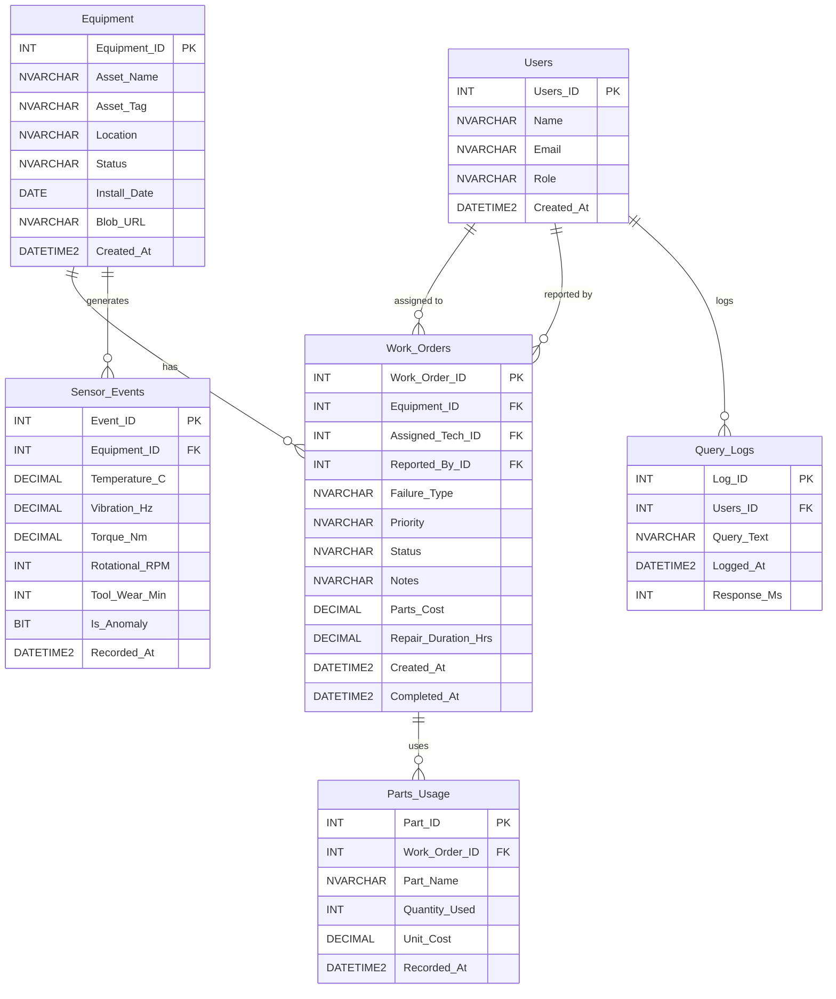

## ER Diagram

```mermaid
erDiagram

    Users {
        INT Users_ID PK
        NVARCHAR Name
        NVARCHAR Email
        NVARCHAR Role
        DATETIME2 Created_At
    }

    Equipment {
        INT Equipment_ID PK
        NVARCHAR Asset_Name
        NVARCHAR Asset_Tag
        NVARCHAR Location
        NVARCHAR Status
        DATE Install_Date
        NVARCHAR Blob_URL
        DATETIME2 Created_At
    }

    Work_Orders {
        INT Work_Order_ID PK
        INT Equipment_ID FK
        INT Assigned_Tech_ID FK
        INT Reported_By_ID FK
        NVARCHAR Failure_Type
        NVARCHAR Priority
        NVARCHAR Status
        NVARCHAR Notes
        DECIMAL Parts_Cost
        DECIMAL Repair_Duration_Hrs
        DATETIME2 Created_At
        DATETIME2 Completed_At
    }

    Parts_Usage {
        INT Part_ID PK
        INT Work_Order_ID FK
        NVARCHAR Part_Name
        INT Quantity_Used
        DECIMAL Unit_Cost
        DATETIME2 Recorded_At
    }

    Sensor_Events {
        INT Event_ID PK
        INT Equipment_ID FK
        DECIMAL Temperature_C
        DECIMAL Vibration_Hz
        DECIMAL Torque_Nm
        INT Rotational_RPM
        INT Tool_Wear_Min
        BIT Is_Anomaly
        DATETIME2 Recorded_At
    }

    Query_Logs {
        INT Log_ID PK
        INT Users_ID FK
        NVARCHAR Query_Text
        DATETIME2 Logged_At
        INT Response_Ms
    }

    %% Relationships
    Equipment       ||--o{ Work_Orders     : "has"
    Users           ||--o{ Work_Orders     : "assigned to"
    Users           ||--o{ Work_Orders     : "reported by"
    Work_Orders     ||--o{ Parts_Usage     : "uses"
    Equipment       ||--o{ Sensor_Events   : "generates"
    Users           ||--o{ Query_Logs      : "logs"

```
